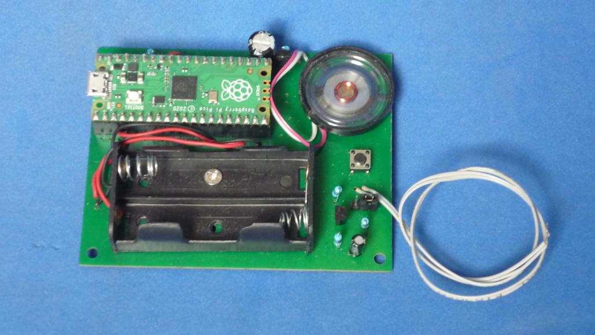

# PEDAL USB BASADO EN RPI PICO

Pedal USB basado en Rpi Pico. Configurable mediante archivo de texto, puede emular pulsaciones de teclas y combinaciones de ellas con sus pies!. Aparece en el PC como un teclado USB estandar. util para edicion de video (pausar/play), comando para maquinas CNC/3D sin usar las manos, entre otras.

Materializado de forma rapida y robusta mediante el sistema de prototipado [TUSISTEMITA](https://github.com/galopago/TUSISTEMITA).

Lea esto en otros idiomas: [English](../README.md)

## Estructura de directorios

* El directorio raiz contiene el programa en CircuitPython y el archivo de configuracion.
* El directorio utils contiene archivos binarios.
* El directorio lib contiene bibliotecas adicionales de CircuitPython.
* El directorio docs contiene archivos adicionales

## Como usar este repositorio
El proyecto esta desarrollado en CircuitPython V6.3
* Conecte interruptores normalmente abiertos (botones, pedales, palancas) entre cada uno de los GPIO requeridos y pines de tierra.
* Conecte un cable Micro USB a USB al Rpi Pico (No lo conecte al computador aun)
* Presione el boton bootsel y mantengalo presionado mientras lo conecta al puerto USB del computador. Una vez conectado deje de presionar bootsel.
* El Rpi Pico aparecera en el escritorio como una unidad de almacenamiento USB llamada Pi RP2 Boot
* Copie el instalador de CircuitPython del directorio utils a la unidad de memoria USB.
* Copie el contenido del directorio lib al directorio lib de la unidad de memoria USB.
* Copie el archivo keys.conf al directorio raiz de la unidad de memoria USB.
* Copie el archivo code.py al directorio raiz de la unidad de memoria USB.(sobreescriba el archivo existente)
* Desconecte el puerto USB y conecte nuevamente
* Listo para usar!

## Enloquecio el puerto USB!
Si por alguna razon experimentando con el codigo se comete algun error, el puerto usb no responde o envia secuencias de teclas de forma muy rapida, se puede "formatear" la memoria haciendo lo siguiente: Desconecte el Rpi Pico, presione bootsel y mantenga presionado, conecte al computador y deje de presionar bootsel. Copi el archivo flash_nuke.uf2 que se encuentra en la carpeta util al directorio raiz de la unidad de memoria USB. Ahora el Rpi Pico esta como nuevo.

## Licencia
Este es un proyecto de Software Libre y esta licenciado bajo una licencia [MIT License](https://spdx.org/licenses/MIT.html)
